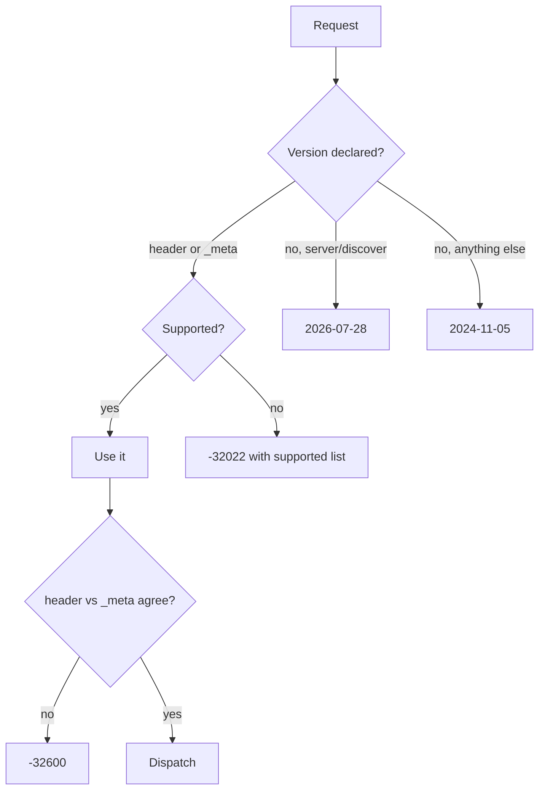

# MCP binding

The orchestrator speaks [Model Context Protocol](https://modelcontextprotocol.io) over a single JSON-RPC 2.0 endpoint, so an agent can drive the whole cart-to-checkout lifecycle as tool calls instead of hand-rolling REST.

```
POST /api/v1/mcp/message
```

Everything on this page runs through the same `OrchestratorFacade` as the REST and A2A surfaces: identical policy, idempotency, provider calls, and metrics. MCP is a transport, not a second implementation.

## Transport

| Property | Value |
|---|---|
| Endpoint | `POST /api/v1/mcp/message` (advertised as `mcp_endpoint` in `/.well-known/ucp`) |
| Payload | JSON-RPC 2.0 request object (`jsonrpc`, `id`, `method`, `params`) |
| Auth | Same as every other API route: `Authorization: Bearer <token>` |
| Version header | `MCP-Protocol-Version` |
| Content type | `application/json` |

There is no SSE or stdio transport. One request, one response.

### Authentication and tenancy

The bearer token resolves to an `AuthContext` (caller, tenant, scopes) before dispatch. Tool arguments never carry tenancy: a `tenant_id` in a tool call is used for lookups scoped to the caller's own tenant, never to cross into another one. `execute_checkout` additionally requires the `checkout:execute` scope.

### Signatures

If the deployment configures `UCP_AGENT_KEYS`, requests to `/api/v1` — including `/api/v1/mcp/message` — must carry valid `Signature` and `Timestamp` headers, and responses are signed back. See [message signing](consumption-guide.md#message-signing-ucp-2026-04-08).

## Version negotiation

The server is **dual-era**: it supports the modern discovery handshake and the legacy `initialize` handshake at once.

| Version | Era | Handshake |
|---|---|---|
| `2026-07-28` | modern | `server/discover`, then a version on every request |
| `2025-11-25` | legacy | `initialize` |
| `2024-11-05` | legacy | `initialize` |

Modern clients declare the version per request, either as the `MCP-Protocol-Version` header or in `params._meta`:

```json
{
  "jsonrpc": "2.0",
  "id": 1,
  "method": "tools/list",
  "params": {
    "_meta": {
      "io.modelcontextprotocol/protocolVersion": "2026-07-28",
      "io.modelcontextprotocol/clientInfo": { "name": "my-agent", "version": "1.0" }
    }
  }
}
```

Rules the server enforces:

- If both the header and `_meta` carry a version and they disagree, the request is rejected with `-32600`.
- An unsupported version returns `-32022` with `data.supported` listing what is accepted, and `data.requested` echoing what you sent.
- Under `2026-07-28`, every result carries `_meta` with `io.modelcontextprotocol/serverInfo` and `io.modelcontextprotocol/protocolVersion`.
- Under `2026-07-28`, `initialize` is rejected with `-32601`: call `server/discover` instead.
- A request with no version at all is treated as `2024-11-05` for backward compatibility, except `server/discover`, which implies the modern version.



## Methods

| Method | Purpose |
|---|---|
| `server/discover` | Modern handshake: supported versions, capabilities, server info |
| `initialize` | Legacy handshake; rejected under `2026-07-28` |
| `notifications/initialized` | Legacy no-op acknowledgement |
| `tools/list` | Tool catalogue with JSON Schema inputs |
| `tools/call` | Invoke a tool by `name` with `arguments` |
| `resources/list` | Readable resource URI templates |
| `resources/read` | Read one resource by `uri` |

## Tools

Seventeen tools cover the lifecycle. Every one maps to a facade operation that the REST API also exposes.

### Cart

| Tool | Required arguments | Notes |
|---|---|---|
| `create_cart` | `merchant_id`, `currency` | Tenancy comes from the bearer token |
| `add_item` | `cart_id`, `item_id`, `quantity` | |
| `update_item_qty` | `cart_id`, `line_id`, `quantity` | |
| `remove_item` | `cart_id`, `line_id` | |
| `apply_adjustment` | `cart_id`, `code` | Priced by your pricing provider; an unknown code changes nothing |
| `set_fulfillment_selection` | `cart_id`, `method_type`, `destination` | Quotes options, and selects one if `selected_option_id` is given |
| `get_cart` | `cart_id` | |

### Checkout and orders

| Tool | Required arguments |
|---|---|
| `start_checkout` | `cart_id`, `cart_version` |
| `execute_checkout` | `tenant_id`, `merchant_id`, `cart_id`, `cart_version`, `currency`, `payment_intent`, `idempotency_key` |
| `get_order` | `order_id` |
| `list_orders` | `tenant_id` |

### Payments

`capture_payment`, `void_payment`, and `refund_payment` all take `tenant_id`, `merchant_id`, `transaction_id`, `amount_minor`, `idempotency_key` and return `{ success, reference }`.

### Catalog

`lookup_catalog_item` (`item_id`), `lookup_catalog_items` (`item_ids`), and `search_catalog_items` (optional `query`).

## Fulfillment selection

`set_fulfillment_selection` covers the UCP `dev.ucp.shopping.fulfillment` extension. It takes the same flat destination shape as `POST /api/v1/ucp/cart/:id/fulfillment`, so an agent learns one contract for both transports.

Omit `selected_option_id` to quote without committing:

```json
{
  "jsonrpc": "2.0",
  "id": 7,
  "method": "tools/call",
  "params": {
    "name": "set_fulfillment_selection",
    "arguments": {
      "cart_id": "6f1c…",
      "method_type": "shipping",
      "destination": {
        "id": "dest_1",
        "street_address": "1 Market St",
        "address_locality": "San Francisco",
        "address_region": "CA",
        "address_country": "US",
        "postal_code": "94105"
      }
    }
  }
}
```

The result is the cart projection; quoted options live under `fulfillment.methods[].groups[].options[]`, and `fulfillment_minor` stays `0` until something is selected. Call again with `selected_option_id` to commit, which adds the option's amount to the cart total and triggers a reprice and geo re-check against the new destination.

For pickup, send `"method_type": "pickup"` and include `name` on the destination for the retail location.

`selected_option_id` must be an id the merchant actually quoted for this cart. Anything else is an error — an agent cannot invent a shipping price.

## Resources

| URI template | Content |
|---|---|
| `order://{id}` | Order as JSON |
| `cart://{id}` | Cart projection as JSON |

`resources/read` returns `contents[0].text` holding the JSON document, with `mimeType: application/json`.

## Errors

Tool and dispatch failures come back as JSON-RPC errors, not as HTTP failures — the transport still returns `200`.

| Code | Meaning |
|---|---|
| `-32601` | Unknown method, or `initialize` under `2026-07-28` |
| `-32600` | `MCP-Protocol-Version` header disagrees with `params._meta` |
| `-32022` | Unsupported protocol version; `data.supported` lists what works |
| `-32603` | Tool failure: unknown tool, missing argument, or a facade error such as a rejected fulfillment option or a failed provider call |

Transport-level problems (a missing or invalid bearer token, a missing or stale signature) are ordinary HTTP errors and never reach the JSON-RPC layer.

## Observability

Every message records `orchestrator_operation_calls_total{operation="mcp_tool_call"}` and the matching latency histogram, split by `success`/`error`, plus a per-tool counter and a counter for the negotiated protocol version. Unsupported version requests increment `mcp_version_unsupported_total`.

## Relationship to ACP's MCP binding

This is the orchestrator's **own** MCP surface. ACP also defines an MCP transport binding that re-expresses ACP checkout operations as MCP tools with OpenRPC descriptors; that binding is **not implemented** — `/.well-known/acp.json` advertises the REST transport only. See the [conformance matrix](standards/conformance-matrix.md).

## See also

- [Consumption guide](consumption-guide.md) — REST shapes, config, message signing
- [Consumer integration](consumer-integration.md) — auth and client setup
- [Conformance matrix](standards/conformance-matrix.md) — protocol coverage and gaps
