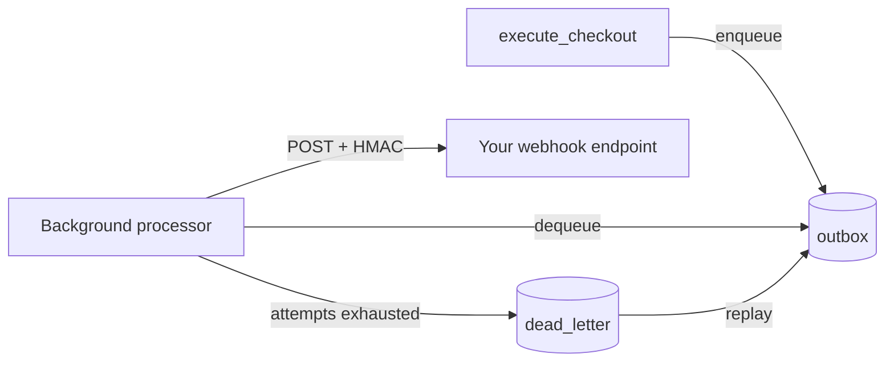

# Runbook: Outbox retries and webhook delivery

## Overview

The orchestrator writes external side effects (for example `order.created`) to an
outbox as part of committing a checkout. A **background processor runs inside the
server process** and drains that outbox, delivering each message to every webhook
registration whose topic filter matches.

Since v0.9.0 you do not need to call the processor yourself. Earlier releases
exposed `process_outbox_once` but never ran it, so in a deployed server the outbox
grew without bound and no webhook was ever delivered.

## Configuration

| Setting | Env var | Default | Meaning |
|---|---|---|---|
| `outbox.interval_ms` | `OUTBOX_INTERVAL_MS` | `500` | Pause between polls when the queue is empty |
| `outbox.batch_size` | `OUTBOX_BATCH_SIZE` | `32` | Messages handled per wake-up |
| `outbox.max_attempts` | `OUTBOX_MAX_ATTEMPTS` | `5` | Delivery attempts before dead-lettering |
| `outbox.drain_timeout_secs` | `OUTBOX_DRAIN_TIMEOUT_SECS` | `10` | How long shutdown waits for the queue to drain |
| `outbox.retry_backoff_ms` | `OUTBOX_RETRY_BACKOFF_MS` | `500` | Pause after a failed delivery, doubled per attempt |
| `outbox.max_retry_backoff_secs` | `OUTBOX_MAX_RETRY_BACKOFF_SECS` | `30` | Ceiling for that pause |

When the queue is non-empty the processor keeps working without pausing, so
`interval_ms` only controls idle polling. A *failed* delivery is the exception: it
pauses for `retry_backoff_ms` doubled per attempt (capped), so an endpoint that is
down is retried slowly instead of spending every attempt within milliseconds and
dead-lettering messages that a later retry would have delivered.

## Multi-replica operation

The Postgres outbox claims with `FOR UPDATE SKIP LOCKED`, so every replica can
run its own processor without delivering the same message twice. No leader
election or singleton deployment is required.

A claim is a lease, not a delete: the row keeps a `locked_until` stamp and is only
removed once delivery has been acknowledged, so a replica that dies mid-delivery
leaves the message for whoever claims it after the lease expires (60s). The
trade-off is at-least-once delivery — a subscriber that received the request just
before a crash can see it again, so webhook handlers should be idempotent on
`X-Webhook-Id`.

Delivery is scoped per tenant: an event is offered only to the webhooks
registered by the tenant that owns it.

## Shutdown behaviour

On `SIGTERM` or `SIGINT` the server stops accepting new work, signals the
processor to stop, and waits up to `drain_timeout_secs` for the queue to empty. If
the drain times out, a warning is logged and the remaining messages stay in the
outbox for the next process (or another replica) to pick up. Nothing is lost.

## Metrics

| Metric | Type | What it tells you |
|---|---|---|
| `orchestrator_queue_depth{queue="outbox"}` | gauge | Current backlog. Sustained growth means downstream failure or insufficient throughput. |
| `orchestrator_queue_depth{queue="dead_letter"}` | gauge | Messages that exhausted their attempts and need investigation. |
| `orchestrator_delivery_attempts{operation="outbox_delivery"}` | histogram | Attempts consumed before a message settled, split by `status`. |
| `orchestrator_events_total{name="webhook_delivery_success_total"}` | counter | Deliveries accepted by a subscriber. |
| `orchestrator_events_total{name="webhook_delivery_failure_total"}` | counter | Deliveries rejected or unreachable. |
| `orchestrator_events_total{name="outbox_dead_letter_total"}` | counter | Messages moved to dead-letter. |
| `orchestrator_operation_latency_seconds{operation="webhook_delivery"}` | histogram | Per-subscriber delivery latency. |

Suggested alerts:

- `orchestrator_queue_depth{queue="outbox"}` above a few hundred for more than
  five minutes — the backlog is not clearing.
- Any increase in `orchestrator_queue_depth{queue="dead_letter"}` — a subscriber
  has been failing long enough to give up on.

Both are charted on the starter Grafana board at
[`deploy/grafana/orchestrator-dashboard.json`](../../deploy/grafana/orchestrator-dashboard.json),
scraped via `deploy/kubernetes/servicemonitor.yaml`.

Counter families are registered without a `_total` suffix and the Prometheus
encoder appends it, so the names above are exactly what `/metrics` exposes.

## Delivery contract

Each delivery is a `POST` with a JSON body of `{ id, topic, payload, correlation_id }`
and these headers:

- `X-Webhook-Id` — the outbox message id, stable across retries. Use it to
  deduplicate on your side.
- `X-Webhook-Topic` — the event topic.
- `X-Webhook-Signature` — hex HMAC-SHA256 of the raw body using the secret you
  supplied at registration. Verify it before trusting the payload.

Any 2xx is treated as accepted. Anything else, including a connection failure,
counts as a failed attempt.

## Operational steps

1. **Watch the depth gauges.** A rising outbox means downstream unavailability or
   too small a batch size; a rising dead-letter count means a subscriber has been
   failing past `max_attempts`.
2. **Inspect dead-letter** with `facade.list_dead_letter().await`; each entry
   carries `id`, `topic`, `correlation_id`, and `attempts`.
3. **Fix the cause first**, then **replay** with
   `facade.replay_from_dead_letter(&message_id).await`, which returns the message
   to the outbox with `attempts` reset to zero.
4. **Registrations are durable.** They live in the `webhooks` table under Postgres
   and in `webhooks.json` under file-backed persistence, so they survive restarts.

## Failure behaviour

- **Deliverer returns `Ok`** — the message is consumed and removed from the outbox.
- **Deliverer returns `Err`** — `attempts` is incremented; the message is
  re-enqueued, or moved to dead-letter once `attempts` exceeds `max_attempts`.
- **No matching registration** — delivery succeeds trivially and the message is
  consumed. An event with no subscriber is not an error.
- **Idempotency** — checkout and payment lifecycle calls use idempotency keys, so
  a duplicate request with the same key returns the original result without
  re-running side effects.
